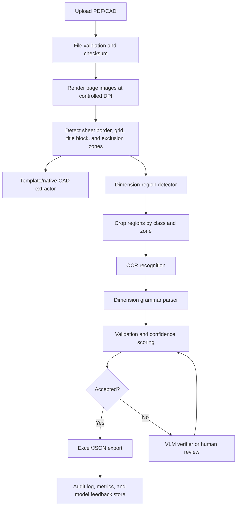

# Production MLOps Pipeline for CAD Dimension Extraction

## Objective

Build a production application that reads plotted CAD PDFs and exports inspection-ready
dimension registers:

```text
Part Number | Zone | Nominal Dimension | Tolerance | Tolerance Value |
Accuracy % | Multiplicity | Lower Limit | Upper Limit | File Name
```

The current PDFs have zero extractable text-layer characters. The drawing text is
plotted as vector paths, so the production pipeline must use geometry, OCR, and
validation together. A general LLM or VLM alone is not reliable enough for final
numeric extraction.

## Recommended Model Stack

### 1. Geometry and deterministic rules

Use this first for every file:

- PDF rendering at controlled DPI.
- CAD border/grid detection.
- Zone mapping from geometry.
- Title-block and note-area exclusion zones.
- Engineering dimension grammar.
- Lower/upper limit calculation.

This layer is deterministic and should be the main safety rail.

### 2. Dimension-region detector

Train a custom object detector to find:

- dimension text groups
- tolerance text groups
- arrow/dimension-line groups
- detail-callout labels
- title block / notes / non-dimension regions to exclude

Recommended models:

- YOLO family through Ultralytics for fast iteration and simple deployment.
- RT-DETR for transformer-based real-time detection where higher precision is
  needed.

Detector output should be bounding boxes with classes and confidence scores.
The detector does not parse numbers; it only decides where OCR should run.

### 3. OCR engine

Run OCR only on cropped detector regions:

- PaddleOCR / PP-OCRv5 for text detection and recognition.
- Tesseract can remain as a low-cost fallback, but it should not be the primary
  production OCR engine for these drawings.

OCR should be run with multiple region rotations where needed:

- 0 degrees
- 90 degrees
- 270 degrees

### 4. Vision-language verifier

Use a VLM only after OCR and deterministic parsing:

- Qwen2.5-VL or Donut for local/open-model review.
- OpenAI vision models for structured validation and human-assist review.

The VLM should answer constrained questions on cropped regions, such as:

```text
Read only the dimension annotation in this crop.
Return JSON with nominal, tolerance, multiplicity, units, and uncertainty.
If unclear, return needs_review=true.
```

Do not let VLM output bypass deterministic validation.

## Production Pipeline



## Confidence Lanes

### Accepted

Rows can be automatically exported as accepted only when:

- detected region is inside a valid drawing zone
- region is not in title block, notes, revision table, or material block
- OCR result matches dimension grammar
- tolerance ratio is plausible
- lower/upper limits compute correctly
- duplicate/repeated dimensions are resolved
- confidence is above threshold

### Review

Rows must be marked for review when:

- OCR is low confidence
- dimension has missing or ambiguous tolerance
- VLM disagrees with OCR
- value is likely a title-block number or part number
- decimal comma/dot repair was applied
- zone assignment is uncertain
- multiple candidates overlap

### Rejected

Rows should be rejected when:

- value comes from title block or notes
- tolerance ratio is impossible
- part number/date/material is parsed as a dimension
- region has no dimension-line/arrow context
- OCR/VLM output does not match grammar

## Data Requirements

### Input data

Collect at least:

- 100-300 PDFs across drawing sizes A4/A3/A2/A1.
- Native CAD/DXF files when available.
- Existing Excel outputs/manual ground truth.
- Rendered page PNGs at fixed DPI.

### Label schema

Use a detector label set like:

```text
dimension_text
tolerance_text
dimension_line
arrowhead
radius_dimension
diameter_dimension
reference_dimension
detail_label
zone_grid
title_block
notes_block
revision_block
material_block
ignore_text
```

### Ground truth row schema

For each accepted dimension:

```text
file_name
part_number
zone
nominal
tolerance_text
tolerance_value
lower_limit
upper_limit
multiplicity
dimension_type
source_bbox
review_status
```

## Training Workflow

1. Render PDFs to images.
2. Label bounding boxes in Label Studio, CVAT, Roboflow, or similar.
3. Split data by part family, not randomly by page:
   - train: 70%
   - validation: 15%
   - test: 15%
4. Train detector.
5. Run OCR on detected crops.
6. Evaluate end-to-end row extraction, not just OCR character accuracy.
7. Promote model only if it improves acceptance accuracy and reduces review load.

## Metrics

### Detector metrics

- mAP50 and mAP50-95 per class.
- Recall for `dimension_text`.
- False positive rate inside title blocks and notes.

### OCR metrics

- Character error rate.
- Numeric exact-match accuracy.
- Tolerance exact-match accuracy.
- Decimal comma/dot repair rate.

### End-to-end metrics

- Row exact-match accuracy.
- Zone accuracy.
- Lower/upper limit accuracy.
- Accepted-row precision.
- Review rate.
- Rejected false-negative rate.

Production gate suggestion:

```text
accepted-row precision >= 99.5%
zone accuracy >= 98%
lower/upper limit accuracy >= 99.5%
review rate <= 20% after template/model maturity
```

## Application Architecture

### Backend services

- API service for upload, extraction, review, and export.
- Worker service for rendering/OCR/model inference.
- Model service for detector and OCR/VLM calls.
- Review service for human validation.

### Storage

- Object storage for PDFs, rendered pages, crops, annotated previews, and exports.
- Database for jobs, rows, review status, model versions, and audit logs.
- Model registry for detector/OCR/VLM configuration versions.

### Frontend

Production UI should include:

- upload page
- extraction job list
- PDF/image viewer with zones
- crop preview per dimension row
- editable dimension table
- accept/reject/review workflow
- Excel export
- audit history

### APIs

Suggested endpoints:

```text
POST /documents
POST /documents/{id}/extract
GET  /jobs/{id}
GET  /documents/{id}/dimensions
PATCH /dimensions/{id}
POST /documents/{id}/export/xlsx
GET  /models/versions
POST /reviews/{dimension_id}/decision
```

## MLOps Requirements

### Versioning

Version all of these:

- source PDF checksum
- rendered image DPI and renderer version
- detector model version
- OCR model version
- VLM prompt/version
- grammar parser version
- extraction code commit
- output Excel checksum

### CI/CD

CI should run:

- Python lint/format/type checks
- unit tests for parser and lower/upper limit logic
- golden-file tests on known PDFs
- batch regression tests on held-out drawings
- schema checks on Excel/JSON output

### Monitoring

Track:

- job success/failure rate
- average processing time per page
- accepted/review/rejected row counts
- OCR confidence distribution
- VLM disagreement rate
- human correction rate by field
- false-positive regions by drawing area
- model drift by part family

### Human-in-the-loop

Every reviewed correction should be saved as training data:

- original crop
- OCR text
- VLM text
- corrected value
- corrected zone
- rejection reason

This feedback store becomes the next training set.

## Deployment Options

### Local/controlled environment

Best for sensitive CAD drawings:

- FastAPI backend
- Celery/RQ workers
- PostgreSQL
- MinIO/S3-compatible object storage
- ONNX/TensorRT detector serving
- PaddleOCR local inference

### Cloud environment

Best for scaling:

- containerized API and workers
- managed PostgreSQL
- S3/GCS/Azure Blob
- GPU worker pool
- model registry
- queue-based async processing

## Security and Compliance

Production CAD handling should include:

- authentication and role-based access control
- encrypted storage
- signed download URLs
- file retention policy
- per-document audit trail
- no training on customer data without explicit approval
- option to disable external VLM calls
- PII/IP classification for drawings

## Implementation Roadmap

### Phase 1: Baseline hardening

- Keep current geometry-first pipeline.
- Add JSON output alongside Excel.
- Add crop snapshots for every candidate row.
- Add title-block/note exclusion detection.
- Add golden tests for `4022.701.4430`.

### Phase 2: Detector prototype

- Label 200-500 dimension regions.
- Train YOLO/RT-DETR detector.
- Run PaddleOCR on detector crops.
- Compare against existing Excel/manual ground truth.

### Phase 3: Review UI

- Build web app with crop viewer and editable dimension table.
- Store corrections as training data.
- Add export after approval.

### Phase 4: Model improvement loop

- Active learning: prioritize low-confidence and disagreement samples.
- Retrain detector/OCR periodically.
- Add VLM verifier only for difficult crops.
- Promote model versions through validation gates.

### Phase 5: Production deployment

- Add async queue workers.
- Add model registry and monitoring dashboards.
- Add CI/CD and batch regression tests.
- Deploy with storage, database, auth, and audit logging.

## Decision

Recommended first production path:

```text
Geometry + custom detector + PaddleOCR + deterministic grammar + human review
```

Use VLMs as a verifier/escalation layer, not as the primary extractor.

## References

- PaddleOCR / PP-OCR: https://github.com/PaddlePaddle/PaddleOCR
- PaddleOCR text detection module: https://paddlepaddle.github.io/PaddleX/3.4/en/module_usage/tutorials/ocr_modules/text_detection.html
- Ultralytics YOLO documentation: https://docs.ultralytics.com/
- Ultralytics custom training: https://docs.ultralytics.com/modes/train/
- RT-DETR official repository: https://github.com/lyuwenyu/RT-DETR
- Donut model documentation: https://huggingface.co/docs/transformers/en/model_doc/donut
- OpenAI vision guide: https://developers.openai.com/api/docs/guides/images-vision
- OpenAI structured outputs guide: https://developers.openai.com/api/docs/guides/structured-outputs
- OpenAI Batch API guide: https://developers.openai.com/api/docs/guides/batch
